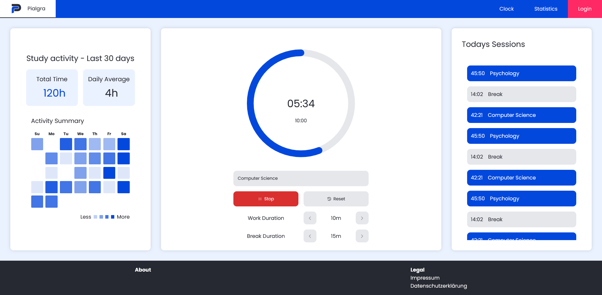

# Pialgra Frontend

Pialgra is a study productivity app designed to help students study more effectively. This repository contains the frontend for the Pialgra project, built with React and JSX. Once everything is working you can check it out at [pialgra.app](https://pialgra.app)

> ⚠️ This project is still under development.

## Development and deployment

For a single-machine deployment at your own domain with automatic HTTPS, follow
[DEPLOYMENT.md](DEPLOYMENT.md). Set `SERVICE_DOMAIN`, `ACME_EMAIL`, and `DB_PASSWORD`
in `.env.production`, then use `compose.production.yaml`. Only the HTTPS proxy
publishes ports; frontend, backend and database communicate through Docker networks.
The domain is configured at runtime and does not require a frontend rebuild.

The deployment files work together:

- `Dockerfile` builds the React app and packages it with nginx.
- `nginx.conf.template` serves the app and forwards API requests to the backend.
- `Caddyfile` configures HTTPS and forwards traffic to nginx.
- `compose.production.yaml` connects the services and imports the backend's
  `compose.yaml`, which uses the backend's own `Dockerfile` to build Java.
- `.dockerignore` excludes dependencies, build output and local secrets from the
  frontend build context; `.env.production.example` documents deployment settings.

Both repositories and both Dockerfiles are required when building this stack.

Run `npm ci`, then `npm run dev`. The development API defaults to
`http://localhost:8080`. Set `VITE_API_BASE_URL` at build time to override it.
Production builds use the same origin by default. The Docker image serves SPA
routes through nginx on port 8081 and proxies `/api/` to `API_UPSTREAM`
(default `http://backend:8080`). `SERVICE_DOMAIN` configures its virtual host
(default `localhost`). The production Compose stack includes Caddy for TLS.

The API client retrieves a session-bound CSRF token before writes. When calling
the backend directly from another origin, add that exact frontend origin to the
backend's `CORS_ALLOWED_ORIGINS` setting.

Run `npm run lint`, `npm test`, and `npm run build` before committing.
`npm audit` checks the npm dependency lockfile for known advisories.

---

## Overview

Pialgra provides tools that help users organize their study sessions, track their learning time, and build better study habits.

The frontend connects to the [Pialgra backend repository](https://github.com/sxpl-DavidSchmidt/Pialgra-backend):

## Features

* **Subject-specific Pomodoro timer**
  Start focused study sessions for individual subjects.

* **Study time tracker**
  Track study time and view statistics about your learning habits.

## Preview

### Clock-Page

  

